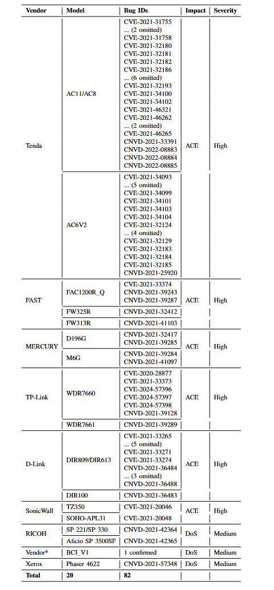

**Table 1: Real-world vulnerabilities discovered by SFuzz.** ACE means arbitrary code execution, DoS represents Denial-of-Service. High severity indicates
that the bug are highly likely exploitable, Medium bugs may lead to denial-of-service attacks. SFuzz++ found 82 bugs and 95.1% could result in high severity
problems in the target system.

